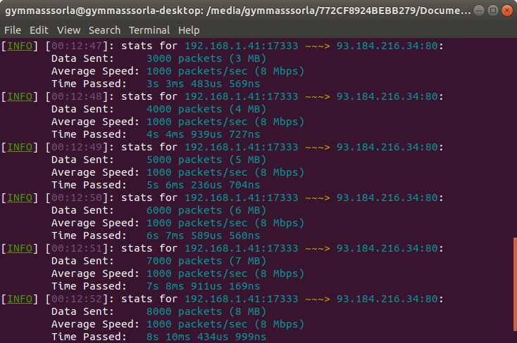

<div align="center">
  <h1>anevicon</h1>
  
  <a href="https://gitter.im/Gymmasssorla/anevicon">
    
  </a>
  <a href="https://travis-ci.com/Gymmasssorla/anevicon">
    
  </a>
  <a href="https://github.com/Gymmasssorla/anevicon/blob/master/LICENSE">
    
  </a>
  <a href="https://crates.io/crates/anevicon">
    
  </a>
  <a href="https://semver.org">
    
  </a>
  
  <br>
  
  <h4>
    <a href="https://github.com/Gymmasssorla/anevicon/pulse">Pulse</a> &middot;
    <a href="https://github.com/Gymmasssorla/anevicon/stargazers">Stargazers</a> &middot;
    <a href="https://github.com/Gymmasssorla/anevicon/releases">Releases</a> &middot;
    <a href="https://github.com/Gymmasssorla/anevicon/blob/master/CONTRIBUTING.md">Contributing</a>
  </h4>
  
  Anevicon is a high-performance traffic generator, designed to be as convenient and reliable as it is possible. It sends
numerous UDP-packets to a server, thereby simulating an activity that can be produced by your end users or a
group of hackers.
</div>

## Installation
```bash
$ cargo install anevicon
```

## Options
```
anevicon 2.1.0
Temirkhan Myrzamadi <gymmasssorla@gmail.com>
An UDP-based server stress-testing tool, written in Rust.

USAGE:
    anevicon [FLAGS] [OPTIONS] --receiver <SOCKET-ADDRESS>...

FLAGS:
    -d, --debug      Enable the debugging mode
    -h, --help       Prints help information
    -V, --version    Prints version information

OPTIONS:
        --display-periodicity <PACKETS>
            A count of packets per displaying test summaries. [default: 300]

    -l, --packet-length <POSITIVE-INTEGER>
            Repeatedly send a random-generated packet with a specified bytes
            length. The default is 32768.
    -p, --packets-count <POSITIVE-INTEGER>
            A count of packets for sending. When this limit is reached, then the
            program will exit. [default: 18446744073709551615]
    -r, --receiver <SOCKET-ADDRESS>...
            A receiver of generated traffic, specified as an IP-address and a
            port number, separated by a colon.
            
            This option can be specified several times to test multiple
            receivers in parallel mode.
            
            All receivers will be tested identically. Run multiple instances of
            this program to describe specific characteristics for each receiver.
    -f, --send-file <FILENAME>
            Interpret the specified file content as a single packet and
            repeatedly send it to each receiver.
    -m, --send-message <STRING>
            Interpret the specified UTF-8 encoded text message as a single
            packet and repeatedly send it to each receiver.
        --send-periodicity <TIME-SPAN>
            A periodicity of sending packets. This option can be used to
            decrease test intensity. [default: 0secs]
    -t, --send-timeout <TIME-SPAN>
            A timeout of sending every single packet. If a timeout is reached,
            an error will be printed. [default: 10secs]
    -s, --sender <SOCKET-ADDRESS>
            A sender of generated traffic, specified as an IP-address and a port
            number, separated by a colon. [default: 0.0.0.0:0]
        --test-duration <TIME-SPAN>
            A whole test duration. When this limit is reached, then the program
            will exit. [default: 64years 64hours 64secs]
    -w, --wait <TIME-SPAN>
            A waiting time span before a test execution used to prevent a launch
            of an erroneous (unwanted) test. [default: 5secs]

For more information see <https://github.com/Gymmasssorla/anevicon>.
```

## Using as a program

### Minimal command
All you need is to provide the testing server address, which consists of an IP address and a port number, separated by the colon character. By default, all sending sockets will have your local address:

```bash
# Test the 80 port of the example.com site using your local address
$ anevicon --receiver 93.184.216.34:80
```

### Multiple receivers
Anevicon also has functionaliy to test multiple receivers in parallel mode, thereby distributing the load on your processor cores. To do so, just specify the `--receiver` option several times.

```bash
# Test the 80 port of example.com and the 13 port of google.com in parallel
$ anevicon --receiver 93.184.216.34:80 --receiver 216.58.207.78:13
```

### IP spoofing
Using the IP spoofing technique, hackers can protect their bandwidth from server response messages and hide their real IP address. You can imitate it via the `--sender` command-line option, as described below:

```bash
# Test the 80 port of the example.com site using its own IP address
$ anevicon --receiver 93.184.216.34:80 --sender 93.184.216.34:80
```

### End conditions
Note that the command above might not work on your system due to the security reasons. To make your test deterministic, there are two end conditions called `--test-duration` and `--packets-count` (a test duration and a packets count, respectively):

```bash
# Test the 80 port of the example.com site with the two limit options
$ anevicon --receiver 93.184.216.34:80 --test-duration 3min --packets-count 7000
```

### Packet size
Note that the test below will end when, and only when one of two specified end conditions become true. And what is more, you can specify a global packet length in bytes:

```bash
# Test the 80 port of example.com with the packet length of 4092 bytes
$ anevicon --receiver 93.184.216.34:80 --packet-length 4092
```

### Custom message
By default, Anevicon will generate a random packet with a specified size. In some kinds of UDP-based tests, packet content makes sense, and this is how you can specify it using the `--send-file` or `--send-message` options:

```bash
# Test the 80 port of example.com with the custom file 'message.txt'
$ anevicon --receiver 93.184.216.34:80 --send-file message.txt

# Test the 80 port of example.com with the custom text message
$ anevicon --receiver 93.184.216.34:80 --send-message "How do you do?"
```

### Test intensity
In some situations, you don't need to generate the maximum amount of packets per second, you might want to decrease intensity of packets sending. To do so, there is one more straightforward option called `--send-periodicity`.

```bash
# Test the 80 port of example.com waiting 270 microseconds after each send
$ anevicon --receiver 93.184.216.34:80 --send-periodicity 270us
```

### Specific options
Wait 7 seconds, and then start to test, displaying summaries after every 400 packets, and exit with an error if time to send a packet is longer than 200 milliseconds:

```bash
# Test the 80 port of the example.com site using the specific options
$ anevicon --receiver 93.184.216.34:80 --wait 7s --display-periodicity 400 --send-timeout 200ms
```

## Using as a library
First, you need to link the library with your executable (or another library) by putting `anevicon_core` to the `dependencies` section in your `Cargo.toml` like this:
```toml
[dependencies]
anevicon_core = "*"
```

Next, just copy this code into your `main` function and launch the compiled program, which simply sends one thousand empty packets to the `example.com` site:
```rust
use anevicon_core::summary::TestSummary;
use anevicon_core::testing::send;

// Setup the socket connected to the example.com domain
let socket = std::net::UdpSocket::bind("0.0.0.0:0").unwrap();
socket.connect("93.184.216.34:80").unwrap();

let packet = vec![0; 32768];
let mut summary = TestSummary::default();

// Execute a test that will send one thousand packets
// each containing 32768 bytes.
for _ in 0..1000 {
    if let Err(error) = send(&socket, &packet, &mut summary) {
        panic!("{}", error);
    }
}

println!(
    "The total seconds passed: {}",
    summary.time_passed().as_secs()
);
```

This is how you are able to build your own stress-testing bot. Now you can follow [the official documentation](https://docs.rs/anevicon_core) to learn more about the `anevicon_core` abstractions.

## Cautions
 - The goal of Anevicon is to produce the maximum possible (for your computer) load on the specified receiver. Thereby, this **DOES NOT MEAN** that Anevicon will break **ABSOLUTELY ANY SERVER** while running on your computer.
 
- Anevicon was developed as a means of testing stress resistance of web servers, and not for hacking, that is, the author of the project **IS NOT RESPONSIBLE** for any damage caused by your use of my program.
 
 - Despite the fact that Anevicon is heavily tested both automatically and manually, does not mean that the author is responsible for any bug in his work because the program comes with **ABSOLUTELY NO WARRANTY**.

## Contacts
[Temirkhan Myrzamadi](https://github.com/Gymmasssorla) <[gymmasssorla@gmail.com](mailto:gymmasssorla@gmail.com)> (the author)
