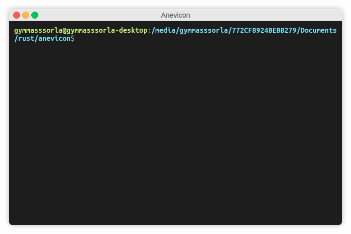

<div align="center">
  <h1>anevicon</h1>
  
  <a href="https://gitter.im/Gymmasssorla/anevicon">
    
  </a>
  <a href="https://travis-ci.com/Gymmasssorla/anevicon">
    
  </a>
  <a href="https://github.com/Gymmasssorla/anevicon/blob/master/LICENSE">
    
  </a>
  <a href="https://crates.io/crates/anevicon">
    
  </a>
  <a href="https://semver.org">
    
  </a>
  
  <br>
  
  Anevicon is a high-performance traffic generator, designed to be as convenient and reliable as it is possible. It sends
numerous UDP-packets to a server, thereby simulating an activity that can be produced by your end users or a
group of hackers.
</div>

## Installation
```bash
$ cargo install anevicon
```

## Usage
```
anevicon 0.1.3
Temirkhan Myrzamadi <gymmasssorla@gmail.com>
An UDP-based server stress-testing tool, written in Rust.

USAGE:
    anevicon [FLAGS] [OPTIONS] --receiver <ADDRESS>

FLAGS:
        --debug      Enable the debugging mode
    -h, --help       Prints help information
    -V, --version    Prints version information

OPTIONS:
        --display-periodicity <PACKETS>
            A count of packets per displaying test summaries. It is not
            recommended to set this option to a small value (say, 6) for the
            performance reasons. [default: 300]
    -d, --duration <TIME-SPAN>
            A program working time. The default value is too big, that is, a
            test will be performed until you explicitly stop the process.
            [default: 64years 64hours 64secs]
    -f, --file <FILENAME>
            A file for sending as a packet. If this option is specified, then
            the program will not generate a random set of bytes, but instead
            read file content.
    -l, --length <BYTES>
            A size of each random-generated UDP-packet, specified in bytes. Note
            that your system or a target server might not be able to handle the
            default value. [default: 65000]
    -p, --packets <COUNT>
            A count of packets for sending. The default value equals to the
            largest number available for the inner data type. [default:
            18446744073709551615]
    -r, --receiver <ADDRESS>
            A receiver of generated traffic, specified as an IP-address and a
            port number, separated by the colon character.
        --send-periodicity <TIME-SPAN>
            A periodicity of sending packets. The default value equals to zero
            seconds, that is, all packets will be sent momentarily. [default:
            0secs]
        --send-timeout <TIME-SPAN>
            If sending calls will continue longer than this timeout, the program
            will exit with an error. By default, all the sending calls will
            continue indefinitely.
    -s, --sender <ADDRESS>
            A sender of generated traffic, specified as an IP-address and a port
            number, separated by the colon character. [default: 0.0.0.0:0]
    -w, --wait <TIME-SPAN>
            A waiting time before a test execution. It is mainly used to prevent
            a launch of an erroneous (unwanted) test. [default: 5secs]

For more information see <https://github.com/Gymmasssorla/anevicon>.
```

## Examples

### Minimal command
All you need is to provide the testing server address, which consists of an IP address and a port number, separated by the colon character. By default, all sending sockets will have your local address:

```bash
# Test the 80 port of the example.com site using your local address
$ anevicon --receiver 93.184.216.34:80
```

### IP spoofing
Using the IP spoofing technique, hackers can protect their bandwidth from server response messages and hide their real IP address. You can imitate it via the `--sender` command-line option, as described below:

```bash
# Test the 80 port of the example.com site using its own IP address
$ anevicon --receiver 93.184.216.34:80 --sender 93.184.216.34:80
```

### End conditions
Note that the command above might not work on your system due to the security reasons. To make your test deterministic, there are two end conditions called `--duration` and `--packets` (a test duration and a packets count, respectively):

```bash
# Test the 80 port of the example.com site with the two limit options
$ anevicon --receiver 93.184.216.34:80 --duration 3min --packets 7000
```

### Packet size
Note that the test below will end when, and only when one of two specified end conditions become true. And what is more, you can specify a global packet length in bytes:

```bash
# Test the 80 port of example.com with the packet length of 4092 bytes
$ anevicon --receiver 93.184.216.34:80 --length 4092
```

### Custom file
By default, Anevicon will generate a random set of bytes which will be used as a sending packet. In some kinds of UDP-based tests, packet content makes sense, and this is how you can specify it using the `--file` option:

```bash
# Test the 80 port of example.com with the custom file 'message.txt'
$ anevicon --receiver 93.184.216.34:80 --file message.txt
```

### Specific options
Wait 7 seconds, and then start to test, displaying summaries after every 400 packets, wait 270 macroseconds between sending two packets, and exit with an error if time to send a packet is longer than 200 milliseconds:

```bash
# Test the 80 port of the example.com site using the specific options
$ anevicon --receiver 93.184.216.34:80 --wait 7s --display-periodicity 400 --send-periodicity 270us --send-timeout 200ms
```

## Cautions
 - The goal of Anevicon is to produce the maximum possible (for the attacking system) load on the specified target address. Thereby, this **DOES NOT MEAN** that Anevicon will break **ABSOLUTELY ANY SERVER** while running on your computer.
 
- Anevicon was developed as a means of testing the stress resistance of servers, and not for hacking, that is, the author of the project **IS NOT RESPONSIBLE** for any damage caused by your use of my program. See [the license notice](https://github.com/Gymmasssorla/anevicon/blob/master/LICENSE#L600).
 
 - Despite the fact that Anevicon is heavily tested both automatically and manually, does not mean that the author is responsible for any bug in his work. The program comes with **ABSOLUTELY NO WARRANTY**, see [the license disclaimer](https://github.com/Gymmasssorla/anevicon/blob/master/LICENSE#L589).

## Contacts
[Temirkhan Myrzamadi](https://github.com/Gymmasssorla) <[gymmasssorla@gmail.com](mailto:gymmasssorla@gmail.com)> (the author)
