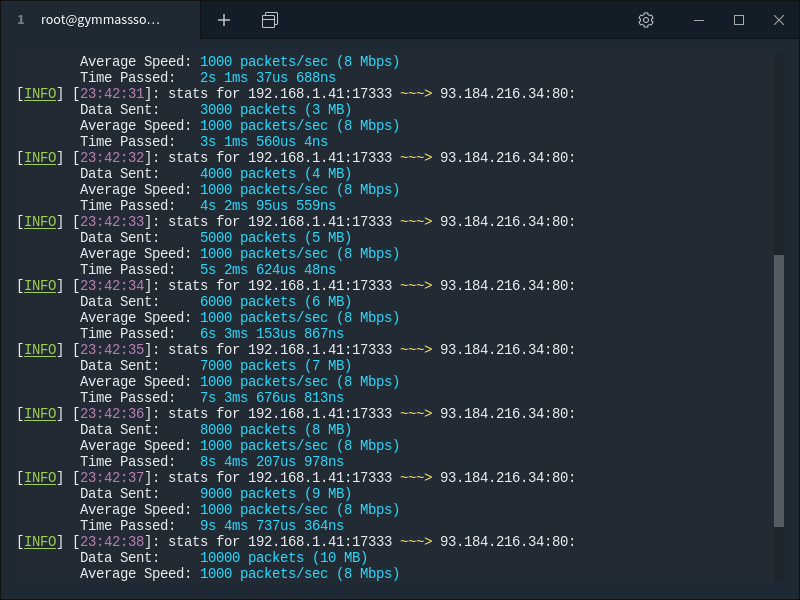

<div align="center">
  <h1>anevicon</h1>
  
  <a href="https://gitter.im/Gymmasssorla/anevicon">
    
  </a>
  <a href="https://travis-ci.com/Gymmasssorla/anevicon">
    
  </a>
  <a href="https://github.com/Gymmasssorla/anevicon/blob/master/LICENSE">
    
  </a>
  <a href="https://crates.io/crates/anevicon">
    
  </a>
  <a href="https://semver.org">
    
  </a>
  
  <br>
  
  Anevicon is a high-performance traffic generator, designed to be as convenient and reliable as it is possible. It sends
numerous UDP-packets to a server, thereby simulating an activity that can be produced by your end users or a
group of hackers.
</div>

## Installation
```bash
$ cargo install anevicon
```

## Usage
```
anevicon 1.1.0
Temirkhan Myrzamadi <gymmasssorla@gmail.com>
An UDP-based server stress-testing tool, written in Rust.

USAGE:
    anevicon [FLAGS] [OPTIONS] --receiver <SOCKET-ADDRESS>

FLAGS:
    -d, --debug      Enable the debugging mode
    -h, --help       Prints help information
    -V, --version    Prints version information

OPTIONS:
        --display-periodicity <PACKETS>
            A count of packets per displaying test summaries. It is highly
            recommended to not set a too small value (say, 6). [default: 300]
    -l, --packet-length <POSITIVE-INTEGER>
            A count of bytes included in a random-generated packet. The default
            value is 32768.
    -p, --packets-count <POSITIVE-INTEGER>
            A count of packets for sending. When this limit is reached, then the
            program will exit. See also the `--test-duration` option. [default:
            18446744073709551615]
    -r, --receiver <SOCKET-ADDRESS>
            A receiver of generated traffic, specified as an IP-address and a
            port number, separated by a colon.
    -f, --send-file <FILENAME>
            A file for sending instead of random-generated packets. You cannot
            use this option and the `--packet-length` together.
        --send-periodicity <TIME-SPAN>
            A periodicity of sending packets. By default, all packets will be
            sent momentarily (without any periodicity). This option can be used
            to decrease test intensity. [default: 0secs]
        --send-timeout <TIME-SPAN>
            A timeout of sending every single packet. If a timeout is reached,
            an error will be printed. [default: 10secs]
    -s, --sender <SOCKET-ADDRESS>
            A sender of generated traffic, specified as an IP-address and a port
            number, separated by a colon. [default: 0.0.0.0:0]
        --test-duration <TIME-SPAN>
            A whole test duration. When this limit is reached, then the program
            will exit. See also the `--packets-count` option. [default: 64years
            64hours 64secs]
    -n, --test-name <STRING>
            A name of a future test. This option lets produce the program
            beautiful output and doesn't make any sense on test performing.
            [default: Unnamed]
    -w, --wait <TIME-SPAN>
            A waiting time span before a test execution used to prevent a launch
            of an erroneous (unwanted) test. [default: 5secs]

For more information see <https://github.com/Gymmasssorla/anevicon>.
```

## Using as a program

### Minimal command
All you need is to provide the testing server address, which consists of an IP address and a port number, separated by the colon character. By default, all sending sockets will have your local address:

```bash
# Test the 80 port of the example.com site using your local address
$ anevicon --receiver 93.184.216.34:80
```

### IP spoofing
Using the IP spoofing technique, hackers can protect their bandwidth from server response messages and hide their real IP address. You can imitate it via the `--sender` command-line option, as described below:

```bash
# Test the 80 port of the example.com site using its own IP address
$ anevicon --receiver 93.184.216.34:80 --sender 93.184.216.34:80
```

### End conditions
Note that the command above might not work on your system due to the security reasons. To make your test deterministic, there are two end conditions called `--duration` and `--packets` (a test duration and a packets count, respectively):

```bash
# Test the 80 port of the example.com site with the two limit options
$ anevicon --receiver 93.184.216.34:80 --test-duration 3min --packets-count 7000
```

### Packet size
Note that the test below will end when, and only when one of two specified end conditions become true. And what is more, you can specify a global packet length in bytes:

```bash
# Test the 80 port of example.com with the packet length of 4092 bytes
$ anevicon --receiver 93.184.216.34:80 --packet-length 4092
```

### Custom message
By default, Anevicon will generate a random set of bytes which will be used as a sending packet. In some kinds of UDP-based tests, packet content makes sense, and this is how you can specify it using the `--file` option:

```bash
# Test the 80 port of example.com with the custom file 'message.txt'
$ anevicon --receiver 93.184.216.34:80 --send-file message.txt
```

### Custom output file
To specify a custom output file for all notifications, warnings, and errors, there is one more option called `--output`. Note that all debugging information will still be written to a terminal.

```bash
# Test the 80 port of example.com with the custom output file 'out.txt'
$ anevicon --receiver 93.184.216.34:80 --output out.txt
```

### Specific options
Wait 7 seconds, and then start to test using the `Axl Rose` name, displaying summaries after every 400 packets, wait 270 macroseconds between sending two packets, and exit with an error if time to send a packet is longer than 200 milliseconds:

```bash
# Test the 80 port of the example.com site using the specific options
$ anevicon --receiver 93.184.216.34:80 --wait 7s --display-periodicity 400 --send-periodicity 270us --send-timeout 200ms --test-name "Axl Rose"
```

## Using as a library

```rust
use anevicon_core::summary::TestSummary;
use anevicon_core::testing::execute;

// Setup the socket connected to the example.com domain
let socket = std::net::UdpSocket::bind("0.0.0.0:0").unwrap();
socket
    .connect("93.184.216.34:80")
    .expect("Cannot connect the socket to example.com");

let mut summary = TestSummary::default();

// Execute a test that will send one thousand packets
// each containing 32768 bytes.
execute(&socket, &vec![0; 32768], &mut summary)
    .take(1000)
    .for_each(|result| {
        if let Err(error) = result {
            panic!("{}", error);
        }
    });

println!(
    "The total seconds passed: {}", summary.time_passed().as_secs()
);
```

For more details please look through [the official documentation](https://docs.rs/anevicon_core).

## Cautions
 - The goal of Anevicon is to produce the maximum possible (for the attacking system) load on the specified target address. Thereby, this **DOES NOT MEAN** that Anevicon will break **ABSOLUTELY ANY SERVER** while running on your computer.
 
- Anevicon was developed as a means of testing stress resistance of web servers, and not for hacking, that is, the author of the project **IS NOT RESPONSIBLE** for any damage caused by your use of my program. See [the license notice](https://github.com/Gymmasssorla/anevicon/blob/master/LICENSE#L600).
 
 - Despite the fact that Anevicon is heavily tested both automatically and manually, does not mean that the author is responsible for any bug in his work. The program comes with **ABSOLUTELY NO WARRANTY**, see [the license disclaimer](https://github.com/Gymmasssorla/anevicon/blob/master/LICENSE#L589).

## Contacts
[Temirkhan Myrzamadi](https://github.com/Gymmasssorla) <[gymmasssorla@gmail.com](mailto:gymmasssorla@gmail.com)> (the author)
